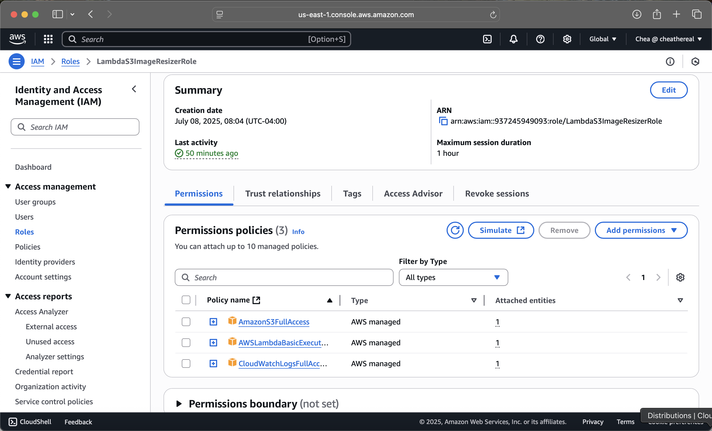
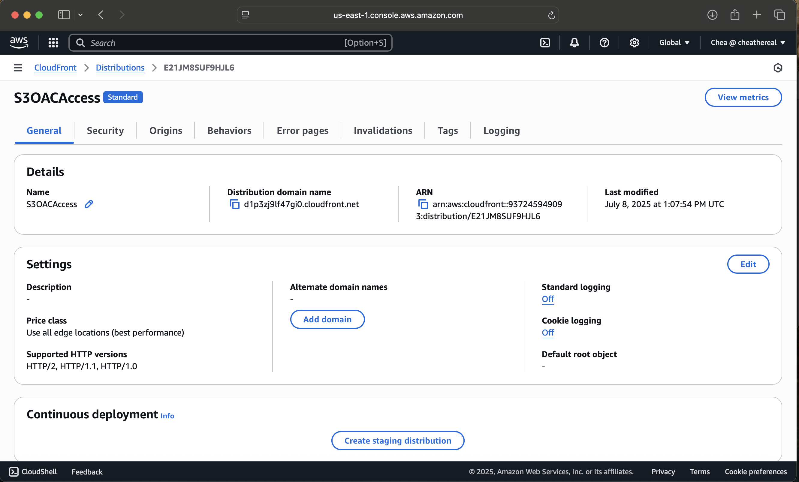
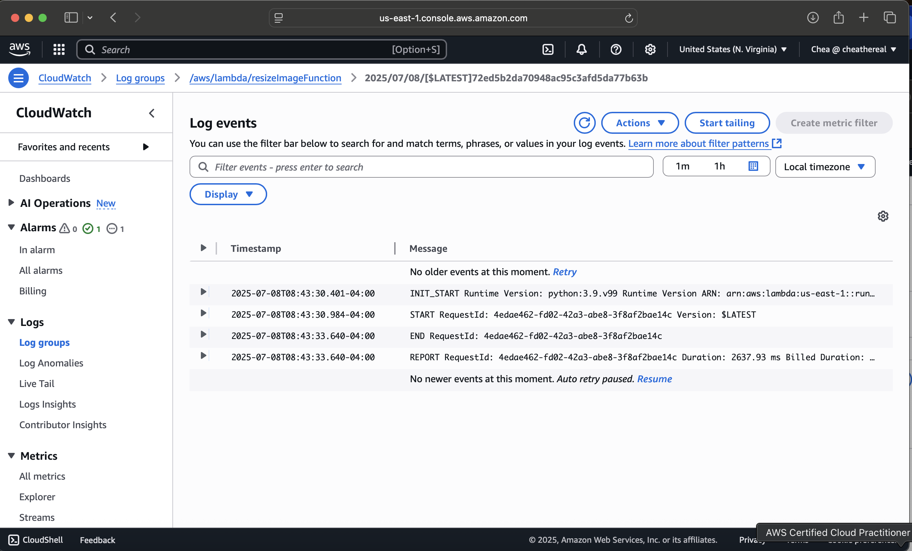
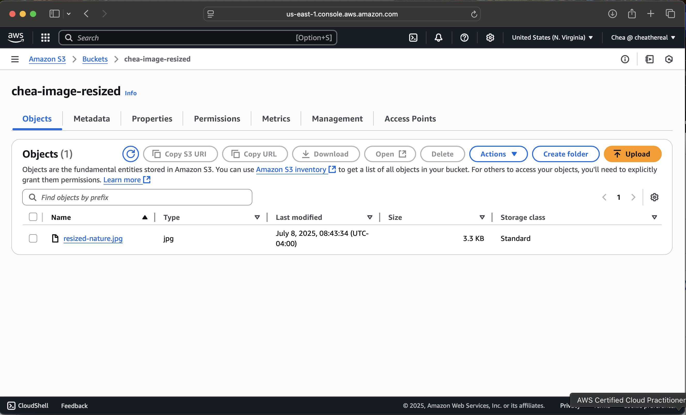
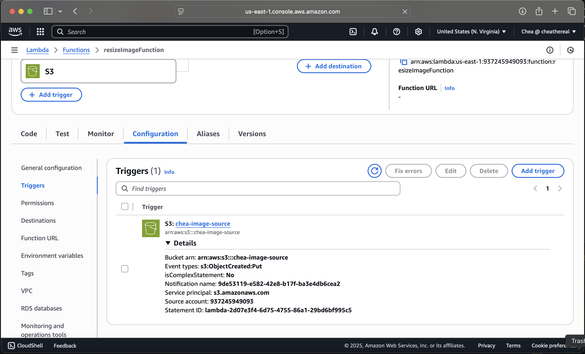

# 🖼️ S3 + Lambda Image Resizer Project

This project automatically resizes images uploaded to an S3 bucket using AWS Lambda and Pillow (Python). The resized images are stored in a second bucket and served globally using CloudFront.

## ✅ What It Does
- Trigger Lambda when a new image is uploaded
- Resize the image using Pillow
- Save resized image to a different S3 bucket
- Serve it securely through a CloudFront distribution

## ⚙️ Tech Stack
- AWS Lambda (Python 3.9)
- Amazon S3
- IAM Roles + Event Triggers
- Pillow library (packaged via Docker)
- CloudWatch for logs
- CloudFront for global distribution

## 📸 Screenshots

| IAM Role | CloudFront | Logs |
|----------|------------|------|
|  |  |  |

| S3 Resized | Lambda Trigger |
|------------|----------------|
|  |  |

## 📝 How I Built It
1. Created S3 source and destination buckets
2. Wrote a Python Lambda function to resize images
3. Used Docker to include the Pillow dependency
4. Uploaded ZIP to Lambda, set trigger from source bucket
5. Configured IAM roles to securely allow access
6. Deployed CloudFront to serve resized images securely

---

Want to run it yourself? Clone the repo and deploy using your own buckets + Lambda setup.
